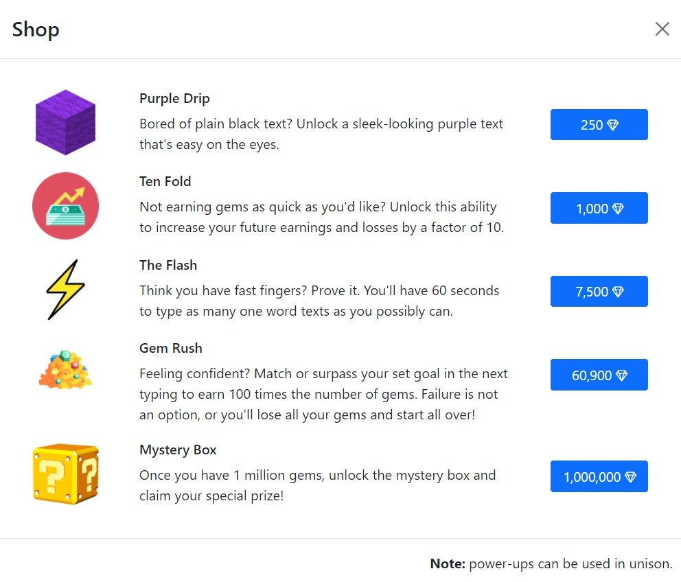
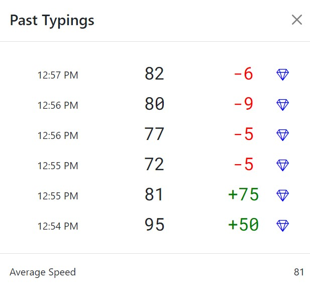

This project was bootstrapped with [Create React App](https://github.com/facebook/create-react-app). Try it out [here](https://typeto1million.netlify.app/).

# Type to 1Million

Type to 1Million <b>isn't your typical typing experience</b>. You not only track and improve your typing speed, but earn gems along the way to purchase power-ups and work your way up to 1 million gems to reveal the mystery prize.

Type to 1Million is <b>typing made fun</b>.

 

 

Keep track of past typing scores and see your progress.

 

 

Set a goal for your typing speed in Settings. Speed is tracked the moment you begin typing. When you match or surpass your goal, you earn an amount of gems equal to your goal.

If you fall short, you'll lose an amount of gems directly proportional to your goal and the difference you were from the goal.

